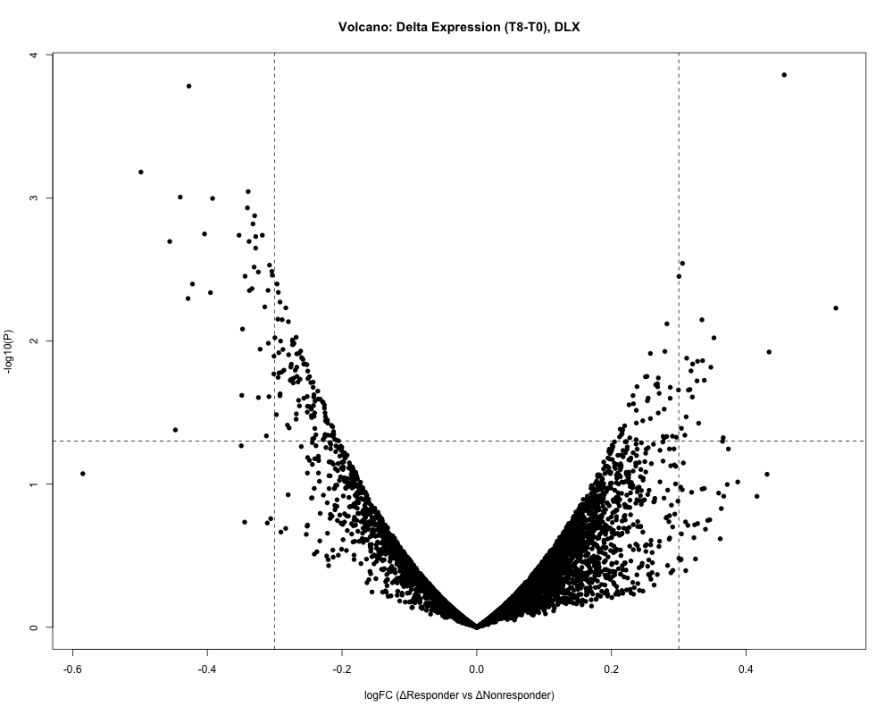
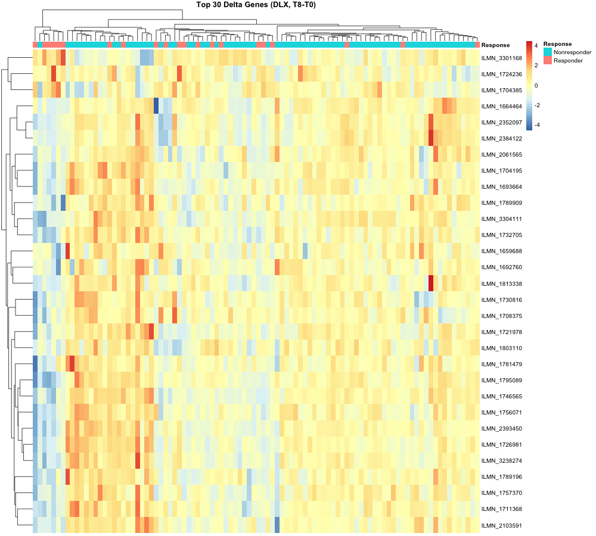
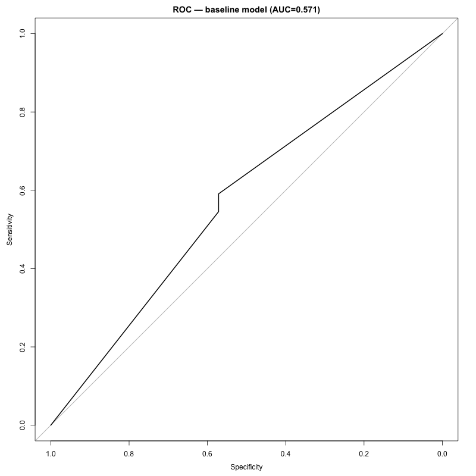
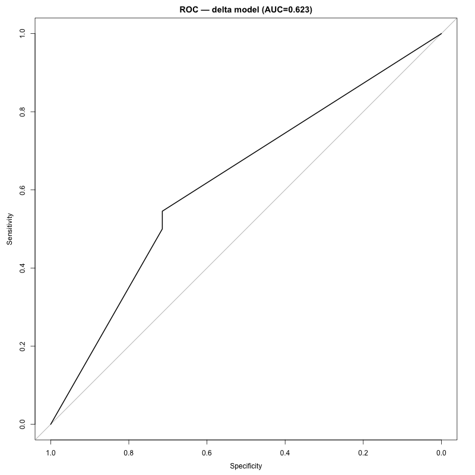

# SSRI Pharmacogenomics Modeling Project  
### GSE146446 – Translational Bioinformatics Analysis

---

## 📌 Project Overview

This project explores pharmacogenomic predictors of antidepressant response using the public RNA-seq dataset **GSE146446**.

The goal is to:

- Identify gene expression signatures associated with SSRI treatment response
- Build predictive models for drug response
- Compare baseline vs treatment-induced (delta) modeling strategies
- Demonstrate reproducible clinical bioinformatics workflow in R

---

## 🧬 Dataset

- GEO Accession: GSE146446
- Platform: RNA-seq
- Total samples: 406
- DLX (drug arm): 96 subjects (T0 + T8)
- Outcome: Treatment response (Responder vs Non-responder)

---

## 🔬 Analysis Workflow

### Week 0 — Data Setup
- Downloaded dataset via GEOquery
- Extracted:
  - `expr_matrix`
  - `pheno_data`
- Built reproducible folder structure

---

### Week 1 — Data Preparation
- Sample alignment (expression vs metadata)
- Extracted baseline (T0)
- Created binary response variable
- Variance filtering (Top 5000 genes)
- Generated modeling-ready dataset

Output:
- `DLX_baseline_modeling_ready.rds`

---

### Week 2 — Differential Expression

Two strategies explored:

#### A) Baseline comparison
Responder vs Non-responder at T0

#### B) Delta expression (T8 − T0)
Drug-induced transcriptional change

Methods:
- limma linear modeling
- eBayes moderation
- BH FDR correction

Outputs:
- DE results CSV
- Volcano plot
- Heatmap (Top 30 genes)

---

### Week 3 — Predictive Modeling

Two models were built:

#### Model 1 — Baseline Model
- Input: Baseline expression
- Feature selection: Top variance genes (train-only)
- Logistic regression
- ROC/AUC evaluation

AUC: **0.571**

---

#### Model 2 — Delta Model
- Input: Δ expression (T8 − T0)
- Same modeling strategy
- Logistic regression

AUC: **0.623**

Delta modeling outperformed baseline, suggesting treatment-induced transcriptional signal improves prediction.

---

## 📊 Visualization

### Delta Volcano Plot

---

### Delta Heatmap

---

### Baseline ROC

---

### Delta ROC

---

## 📁 Project Structure

ssri-pgx-mdd-gse146446/
│
├── data/
│ ├── DLX_baseline_modeling_ready.rds
│ └── processed/DLX_delta_data.rds
│
├── scripts/
│ ├── 01_cleaning.R
│ ├── 02_DE_analysis.R
│ └── 03_modeling.R
│
├── results/
│ ├── ROC_baseline.png
│ ├── ROC_delta.png
│ ├── heatmap_delta.png
│ ├── volcano_delta.png
│ └── model_metrics.txt
│
└── README.md

---

## 🧠 Key Skills Demonstrated

- Clinical RNA-seq data processing
- Metadata harmonization
- Differential gene expression analysis (limma)
- Logistic regression modeling
- ROC/AUC performance evaluation
- Reproducible research structure
- GitHub version control workflow

---

## 🚀 Future Enhancements

- 5-fold cross-validation
- Random Forest comparison
- Pathway enrichment analysis
- Feature importance interpretation
- Clinical model explanation

---

## 👩‍💻 Author

Eugenia Yi  
Translational Bioinformatics Modeling Project  
Built in R
